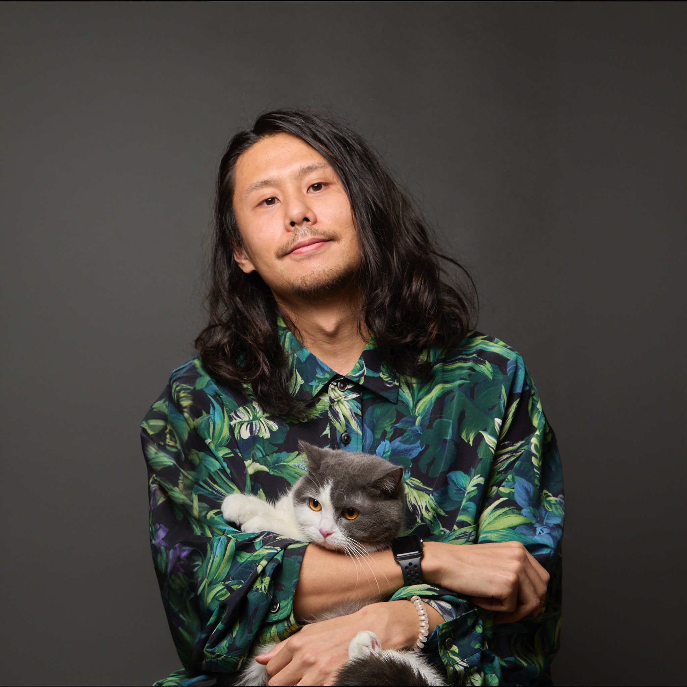

  

    

      <header class="site-header">
        

        
        

        <h3 class="title">{{ site.title }}</h3>
      </header>
    

  

I am an associate distinguished researcher at [NTT](https://www.rd.ntt/e/cds/).
My research interests are machine learning with synthetic data, generative models, vision-language models, explainability, distribution shifts, self-supervised learning, and semi-supervised learning.

# Updates
* **[2025/11/10]** Our paper **Distribution Highlighted Reference-based Label Distribution Learning for Facial Age Estimation** has been accepted to WACV 2026!
* **[2025/11/9]** Our paper **[Difference Vector Equalization for Robust Fine-tuning of Vision-Language Models](https://arxiv.org/abs/2511.09973)** has been accepted to AAAI 2026 (Acceptance Rate: 17.6%)! We proposed a robust fine-tuning method for CLIP-like models, which preserves geometric structures in feature spaces to maintain zero-shot performance.
* **[2025/9/24]** My doctoral dissertation, **[Dataset Synthesis with Deep Generative Models](https://repository.kulib.kyoto-u.ac.jp/items/610a9db4-75a2-4a2f-bf9c-d0bf94578190)**, has been accepted, and I received a PhD in Informatics!
* **[2025/4/1]** Our paper [**Evaluation of Time-Series Training Dataset through Lens of Spectrum of Deep State Space Models**](https://arxiv.org/abs/2408.16261) has been accepted to IJCNN 2025!
* **[2025/2/26]** Our paper [**Post-pre-training for Modality Alignment in Vision-Language Foundation Models**](https://arxiv.org/abs/2504.12717) has been accepted to CVPR 2025! We propose a very lightweight post-pre-training method for aligning pre-trained vision-language models like CLIP.
* **[2025/01/22]** Our paper [**Test-time Adaptation for Regression by Subspace Alignment**](https://arxiv.org/abs/2410.03263) has been accepted to ICLR 2025! This paper proposes a novel test-time adaptation method for regression tasks by aligning features on a subspace.
* **[2025/01/21]** Our paper [**Transfer Learning with Pre-trained Conditional Generative Models**](https://arxiv.org/abs/2204.12833) has been accepted to Machine Learning Journal (ECML-PKDD Journal Track)! We propose a generative transfer learning method based on pre-trained large generative models for a severe setting where we cannot access source datasets and pre-trained weights for target tasks.
* **[2024/12/10]** Our paper [**Explanation Bottleneck Models**](https://arxiv.org/abs/2409.17663) has been accepted to AAAI 2025 (**acceptance rate: 23%**)! We propose a new interpretable model that generates text explanations and predicts the final label based on the text explanation. This work will be presented at the Workshop on Foundation Model Intervention (MINT) @ NeurIPS2024!

  
<b><u>Past Updates</u></b>

  * **[2024/9/5]** My solo paper [**Analyzing Diffusion Models on Synthesizing Training Datasets**](https://proceedings.mlr.press/v260/yamaguchi25a.html) and co-authored paper [**Toward Data Efficient Model Merging between Different Datasets without Performance Degradation**](https://arxiv.org/abs/2306.05641) have been accepted to ACML 2024 (**acceptance rate: 20%**)!
  * **[2024/4/1]** I'm happy to announce that I have been promoted to an associate distinguished researcher at NTT!
  * **[2024/3/18]** Our two papers [**Test-Time Similarity Modification for Person Re-Identification Toward Temporal Distribution Shift**](https://arxiv.org/abs/2403.14114) and [**Test-Time Adaptation Meets Image Enhancement: Improving Accuracy via Uncertainty-Aware Logit Switching**](https://arxiv.org/abs/2403.17423) have been accepted to IJCNN 2024!
  * **[2024/2/26]** Our paper [**Adaptive Random Feature Regularization on Fine-tuning Deep Neural Networks**](https://arxiv.org/abs/2403.10097) has been accepted to CVPR 2024! We propose a simple yet effective fine-tuning method by penalizing feature extractors with random reference vectors generated from adaptive class-conditional priors.
  * **[2023/11/23]** Our preprint [**On the Limitation of Diffusion Models for Synthesizing Training Datasets**](https://arxiv.org/abs/2311.13090) appeared in arXiv! We analyzed diffusion models with various perspectives and found that modern diffusion models have a limitation on the ability to replicate datasets in terms of accuracy when the synthetic samples are used for training classifiers. This work will be presented at [NeurIPS 2023 SyntheticData4ML Workshop](https://www.syntheticdata4ml.vanderschaar-lab.com/). 
  * **[2023/11/15]** My solo paper [**Generative Semi-supervised Learning with Meta-Optimized Synthetic Samples**](https://arxiv.org/abs/2309.16143) has been received Best Paper Award from ACML 2023! 
  * **[2023/09/22]** Our paper [**Regularizing Neural Networks with Meta-Learning Generative Models**](https://arxiv.org/abs/2307.13899) has been accepted to NeurIPS 2023! In this paper, we propose a novel meta-learning-based regularization method (MGR) using synthetic samples from pre-trained generative models. In contrast to conventional generative data augmentation methods, MGR utilizes synthetic samples for regularizing only feature extractors and finds useful samples through meta-learning of latent variables.
  * **[2023/09/11]** My solo paper [**Generative Semi-supervised Learning with Meta-Optimized Synthetic Samples**](https://arxiv.org/abs/2309.16143) has been accepted to ACML 2023! This paper proposes a real unlabeled-dateless semi-supervised learning that utilizes a foundation generative model as the unlabeled data source. We introduce a meta-optimization-based sampling algorithm for extracting synthetic unlabeled data from the foundation generative model and a cosine similarity-based unsupervised loss function for updating the feature extractor of the classifier by the synthetic samples.

---

# Activities
## Services as a Reviewer
- 2022: ICML, NeurIPS
- 2023: CVPR, PAKDD, ICML, ICCV, NeurIPS, IPSJ, DMLR@ICML2023, BMVC, ACML, TNNLS
- 2024: WACV, ICLR, CVPR, DMLR@ICLR2024, ICML, ECCV, NeurIPS, NeurIPS DB Track, ACML, DMLR@ICML2024, TMLR
- 2025: AAAI, ICLR, AISTATS, CVPR, ICML, TMLR, ICCV, NeurIPS, Pattern Recognition
- 2026: WACV, AAAI, ICLR

---

# Biography
### Apr. 2017 - Current
Researcher at NTT

### Apr. 2022 - Sep. 2025
Ph.D in Informatics from Dept. of Intelligence Science & Technology, Graduate School of Informatics, Kyoto University (Supervisor: Hisashi Kashima)

### Apr. 2015 - Mar. 2017
M.E. from Dept. of Computer Engineering, Graduate School of Engineering, Yokohama National University (Supervisor: Kimio Kuramitsu)

### Apr. 2011 - Mar. 2015
B.E. from Dept. of Computer Engineering, Yokohama National University (Supervisor: Kimio Kuramitsu)

---

# Publications
- [Google Scholar](https://scholar.google.com/citations?user=_xJYVD0AAAAJ)
- [DBLP](https://dblp.org/pid/215/6588.html)

## International Conference
1. S. Suzuki, <u>S. Yamaguchi</u>, S. Takeda, T. Yamane, N. Makishima, N. Kawata, M. Ihori, T. Tanaka, S. Orihashi, R. Masumura,  
**Distribution Highlighted Reference-based Label Distribution Learning for Facial Age Estimation**,  
The IEEE/CVF Winter Conference on Applications of Computer Vision (WACV), 2026. 
2. S. Suzuki, <u>S. Yamaguchi</u>, S. Takeda, T. Yamane, N. Makishima, N. Kawata, M. Ihori, T. Tanaka, S. Orihashi, R. Masumura,  
[**Difference Vector Equalization for Robust Fine-tuning of Vision-Language Models**](https://arxiv.org/abs/2511.09973),  
AAAI Conference on Artificial Intelligence (AAAI), 2026. 
3. S. Kanai, Y. Ida, K. Adachi, M. Uchida, T. Yoshida, <u>S. Yamaguchi</u>,  
[**Evaluating Time-Series Training Dataset through Lens of Spectrum in Deep State Space Models**](https://arxiv.org/abs/2408.16261),  
International Joint Conference on Neural Networks (IJCNN), 2025. 
4. <u>S. Yamaguchi</u>, F. Dewei, S. Kanai, K. Adachi, D. Chijiwa,  
[**Post-pre-training for Modality Alignment in Vision-Language Foundation Models**](https://arxiv.org/abs/2504.12717),  
The IEEE/CVF Conference on Computer Vision and Pattern Recognition (CVPR), 2025. [[Code]](https://github.com/yshinya6/clip-refine)  
5. K. Adachi, <u>S. Yamaguchi</u>, A. Kumagai,  
[**Test-time Adaptation for Regression by Subspace Alignment**](https://arxiv.org/abs/2410.03263),  
International Conference on Learning Representations (ICLR), 2025. [[OpenReview]](https://openreview.net/forum?id=SXtl7NRyE5)  
6. <u>S. Yamaguchi</u> and K. Nishida,  
[**Explanation Bottleneck Models**](https://arxiv.org/abs/2409.17663),  
AAAI Conference on Artificial Intelligence (AAAI), **Oral**, 2025. [[Code]](https://github.com/yshinya6/xbm) 
7.  <u>S. Yamaguchi</u>,  
[**Analyzing Diffusion Models on Synthesizing Training Datasets**](https://proceedings.mlr.press/v260/yamaguchi25a.html),  
Asian Conference on Machine Learning (ACML), 2024. [[OpenReview]](https://openreview.net/forum?id=x2PY6GP9GJ) 
8. M. Yamada, T. Yamashita, <u>S. Yamaguchi</u>, D. Chijiwa,  
[**Toward Data Efficient Model Merging between Different Datasets without Performance Degradation**](https://proceedings.mlr.press/v260/yamada25a.html),  
Asian Conference on Machine Learning (ACML), 2024. [[arXiv]](https://arxiv.org/abs/2306.05641) [[OpenReview]](https://openreview.net/forum?id=Le3qPaeSAn) 
9. K. Adachi, S. Enomoto, T. Sasaki, <u>S. Yamaguchi</u>,  
[**Test-Time Similarity Modification for Person Re-Identification Toward Temporal Distribution Shift**](https://arxiv.org/abs/2403.14114),  
International Joint Conference on Neural Networks (IJCNN), 2024. 
10. S. Enomoto, N. Hasegawa, K. Adachi, T. Sasaki, <u>S. Yamaguchi</u>, S. Suzuki, T. Eda,  
[**Test-Time Adaptation Meets Image Enhancement: Improving Accuracy via Uncertainty-Aware Logit Switching**](https://arxiv.org/abs/2403.17423),  
International Joint Conference on Neural Networks (IJCNN), 2024. 
11. <u>S. Yamaguchi</u>, S. Kanai, K. Adachi, D. Chijiwa,  
[**Adaptive Random Feature Regularization on Fine-tuning Deep Neural Networks**](https://openaccess.thecvf.com/content/CVPR2024/html/Yamaguchi_Adaptive_Random_Feature_Regularization_on_Fine-tuning_Deep_Neural_Networks_CVPR_2024_paper.html),  
The IEEE/CVF Conference on Computer Vision and Pattern Recognition (CVPR), 2024. [[Code]](https://github.com/yshinya6/adarand) [[arXiv]](https://arxiv.org/abs/2403.10097) 
12. <u>S. Yamaguchi</u>, S. Kanai, A. Kumagai, D. Chijiwa, H. Kashima,  
[**Regularizing Neural Networks with Meta-Learning Generative Models**](https://arxiv.org/abs/2307.13899),  
Neural Information Processing Systems (NeurIPS), 2023. 
13. <u>S. Yamaguchi</u>,  
[**Generative Semi-supervised Learning with Meta-Optimized Synthetic Samples**](https://proceedings.mlr.press/v222/yamaguchi24a.html),  
Asian Conference on Machine Learning (ACML), **Best Paper Award**, 2023. 
14. S. Suzuki, <u>S. Yamaguchi</u>, S. Takeda, S. Kanai, N. Makishima, A. Ando, R. Masumura,  
[**Adversarial Finetuning with Latent Representation Constraint to Mitigate Accuracy-Robustness Tradeoff**](https://arxiv.org/abs/2308.16454),  
The IEEE/CVF International Conference on Computer Vision (ICCV), 2023.
15. K. Adachi, <u>S. Yamaguchi</u>, A. Kumagai,  
[**Covariance-aware Feature Alignment with Pre-computed Source Statistics for Test-time Adaptation**](https://arxiv.org/abs/2204.13263),  
IEEE International Conference on Image Processing (ICIP), 2023.
16. S. Kanai, <u>S. Yamaguchi</u>, M. Yamada, H. Takahashi, Y. Ida,  
[**Switching One-Versus-the-Rest Loss to Increase the Margin of Logits for Adversarial Robustness**](https://arxiv.org/abs/2207.10283),  
International Conference on Machine Learning (ICML), 2023.
17. D. Chijiwa, <u>S. Yamaguchi</u>, A. Kumagai, Y. Ida,  
[**Meta-ticket: Finding optimal subnetworks for few-shot learning within randomly initialized neural networks**](https://arxiv.org/abs/2205.15619),  
Neural Information Processing Systems (NeurIPS), 2022.
18. K. Adachi, <u>S. Yamaguchi</u>,  
[**Learning Robust Convolutional Neural Networks with Relevant Feature Focusing via Explanations**](https://arxiv.org/abs/2202.04237),  
IEEE International Conference on Multimedia & Expo (ICME), 2022.
19. D. Chijiwa, <u>S. Yamaguchi</u>, Y. Ida, K. Umakoshi, T. Inoue,  
[**Pruning Randomly Initialized Neural Networks with Iterative Randomization**](https://openreview.net/pdf?id=QCPY2eMXYs),  
Neural Information Processing Systems (NeurIPS, **Spotlight**), 2021. [[arXiv]](https://arxiv.org/abs/2106.09269) [[Code]](https://github.com/dchiji-ntt/iterand)
20. <u>S. Yamaguchi</u>, S. Kanai,  
[**F-Drop&Match: GANs with a Dead Zone in the High-Frequency Domain**](https://openaccess.thecvf.com/content/ICCV2021/html/Yamaguchi_F-DropMatch_GANs_With_a_Dead_Zone_in_the_High-Frequency_Domain_ICCV_2021_paper.html),  
International Conference on Computer Vision (ICCV), 2021. [[arXiv]](https://arxiv.org/abs/2106.02343)
21. <u>S. Yamaguchi</u>, S. Kanai, T. Shioda, S. Takeda,  
[**Image Enhanced Rotation Prediction for Self-Supervised Learning**](https://ieeexplore.ieee.org/document/9506132),  
IEEE International Conference on Image Processing (ICIP), 2021. [[arXiv]](https://arxiv.org/abs/1912.11603)
22. S. Kanai, M. Yamada, <u>S. Yamaguchi</u>, H. Takahashi, Y. Ida,   
[**Constraining Logits by Bounded Function for Adversarial Robustness**](https://ieeexplore.ieee.org/document/9533777),  
International Joint Conference on Neural Networks (IJCNN), 2021. [[arXiv]](https://arxiv.org/abs/2010.02558)
23. <u>S. Yamaguchi</u>, S. Kanai, T. Eda,  
[**Effective Data Augmentation with Multi-Domain Learning GANs**](https://ojs.aaai.org/index.php/AAAI/article/view/6131),  
AAAI Conference on Artificial Intelligence (AAAI), 2020. [[arXiv]](https://arxiv.org/abs/1912.11597)
24. <u>S. Yamaguchi</u>, K. Kuramitsu,  
[**A Fusion Techniques of Schema and Syntax Rules for Validating Open Data**](https://link.springer.com/chapter/10.1007/978-3-319-56660-3_37),  
Asian Conference on Intelligent Information and Database Systems (ACIIDS), 2017

## International Journal
1. <u>S. Yamaguchi</u>, S. Kanai, A. Kumagai, D. Chijiwa, H. Kashima,  
[**Transfer Learning with Pre-trained Conditional Generative Models**](https://arxiv.org/abs/2204.12833),  
Machine Learning Journal (ECML-PKDD Journal Track), 2025.
2. T. Sasaki, A. S. Walmsley, S. Enomoto, K. Adachi, <u>S. Yamaguchi</u>  
**[Key Factors Determining the Required Number of Training Images in Person Re-Identification](https://ieeexplore.ieee.org/document/10681056)**,  
IEEE Access.

## International Workshop (Refereed)
1. <u>S. Yamaguchi</u> and K. Nishida,  
[**Toward Explanation Bottleneck Models**](https://openreview.net/forum?id=QsF1gbGwpf),  
NeurIPS Workshop on Foundation Model Interventions (MINT), 2024. 
2. K. Adachi, <u>S. Yamaguchi</u>, Atsutoshi Kumagai  
[**Test-time Adaptation for Regression by Subspace Alignment**](https://tta-cvpr2024.github.io/_downloads/5c8596c2798bf34ada89ed342bb08d51/matc_1_test_time_adaptation_for_regre.pdf),  
The 1st Workshop on Test-Time Adaptation at CVPR 2024. **Special Mentioned.**
3. <u>S. Yamaguchi</u>,  
**Analyzing Diffusion Models on Synthesizing Training Datasets**,  
Data-centric Machine Learning Workshop at ICLR 2024. 
4. <u>S. Yamaguchi</u> and T. Fukuda,  
[**On the Limitation of Diffusion Models for Synthesizing Training Datasets**](https://arxiv.org/abs/2311.13090),  
SyntheticData4ML Workshop at NeurIPS 2023. 
5.  <u>S. Yamaguchi</u>, S. Kanai, A. Kumagai, D. Chijiwa, H. Kashima,  
[**Regularizing Neural Networks with Meta-Learning Generative Models**](https://arxiv.org/abs/2307.13899),  
Data-centric Machine Learning Research (DMLR) Workshop at ICML 2023. 

## Preprints
1. <u>S. Yamaguchi</u>, K. Nishida, D. Chijiwa,  
[**Rationale-Enhanced Decoding for Multi-modal Chain-of-Thought**](https://arxiv.org/abs/2507.07685),  
arXiv, 2025.   
2. K. Adachi, <u>S. Yamaguchi</u>, T. Hamagami,  
[**Uniformity First: Uniformity-aware Test-time Adaptation of Vision-language Models against Image Corruption**](https://arxiv.org/abs/2505.12912),  
arXiv, 2025. [[Code]](https://github.com/kzkadc/uninfo)  
3. <u>S. Yamaguchi</u>, S. Kanai, T. Shioda, S. Takeda,  
[**Multiple pretext-task for self-supervised learning via mixing multiple image transformations**](https://arxiv.org/abs/1912.11603v1),  
arXiv, 2019.
4. K. Kuramitsu, <u>S. Yamaguchi</u>,  
[**XML Schema Validation using Parsing Expression Grammars**](https://peerj.com/preprints/1503.pdf),  
PeerJ PrePrints, 2015

## Thesis
- [**Dataset Synthesis with Deep Generative Models**](https://repository.kulib.kyoto-u.ac.jp/items/610a9db4-75a2-4a2f-bf9c-d0bf94578190)
  - for Ph.D in Informatics at Kyoto University
  - Supervisor: Hisashi Kashima (Kyoto University)
  - Comittee: Koh Nishino and Hidetoshi Shimodaira (Kyoto University)

---

# Honors
- Outstanding Reviewer: ICML 2022, NeurIPS 2024 Main Track, NeurIPS 2024 Dataset & Benchmark Track
- 令和四年度 (2022) PRMU研究奨励賞 (outstanding research award at a Japanese domestic conference)
- ACML2023 Best Paper Award

<!-- Global site tag (gtag.js) - Google Analytics -->

